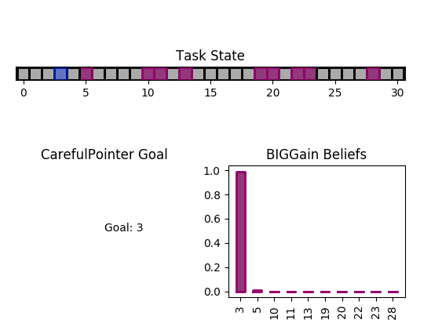

.. bundles:

Bundles
==================
Bundles are the components that combine one or two agents with a task to obtain an environment that can be used to evaluate and/or train either one of the agents. There should rarely be a need to code your own bundle; usually instantiating a bundle is enough. However, some specific workings of the bundle impact the way agents are implemented e.g. with the ``finit()`` [link] method, and we will thus spend some time in this guide to understand how bundles work.

The main API methods are the same as gym's:

* ``reset()``
* ``step()``
* ``render()``
* ``close()``

The arguments of the step method depend on each bundle, see [link].

A bundle can be itinialized simply from a task and two compatible agents:

.. code-block:: python

    task = SimplePointingTask(gridsize = 31, number_of_targets = 8)
    user = CarefulPointer()
    assistant = ConstantCDGain(1)

    bundle = PlayNone(task, user, assistant)
    game_state = bundle.reset()
    bundle.render('plotext')
    while True:
        sum_rewards, is_done, rewards = bundle.step()
        bundle.render('plotext')
        if is_done:
            bundle.close()
            break

Some bundles accept only a task and one agent:

.. code-block:: python

    fitts_W = 4e-2
    fitts_D = 0.8
    ocular_std = 0
    swapping_std = 0.1
    task = ChenEyePointingTask(fitts_W, fitts_D, ocular_std)
    user = ChenEye(swapping_std)
    bundle = SinglePlayUserAuto(task, user)
    bundle.reset()
    bundle.render('plotext')
    while True:
        obs, reward, is_done, _ = bundle.step()
        bundle.render('plotext')
        if is_done:
            break

The Bundle Class
--------------------

This is the main class from which all bundles are derived.

The ``__init()__`` method
"""""""""""""""""""""""""""""
The following operations are performed in the ``__init__()`` method

* Adding a reference to the bundle to each of its components (task, user, assistant). This allows either component to get information e.g. during rendering or initializing.

* Add an 'AssistantAction' substate to the user's state and an 'UserAction' substate to the assistant's state.

* Produce the game state from the individual states of the components. The game state is an ``OrderedDict`` with explicit keys, whose values are the states of each component.

.. code-block:: python

    >>> bundle.game_state
    OrderedDict([('b_state', OrderedDict([('next_agent', [0])])), ('task_state', OrderedDict([('Gridsize', [31]), ('Position', [8]), ('Targets', [2, 3, 5, 10, 11, 15, 16, 23, 24, 29])])), ('user_state', OrderedDict([('AssistantAction', [array([-4.9318438], dtype=float32)]), ('Goal', [24])])), ('assistant_state', OrderedDict([('UserAction', [0])]))])

.. note::

    A more user friendly representation of the game state is available by calling bundle in the interpreter

    .. code-block:: python

        >>> bundle
        b_state/next_agent/0  0
        task_state/Gridsize/0  31
        task_state/Position/0  8
        task_state/Targets/0  2
        task_state/Targets/1  3
        task_state/Targets/2  5
        task_state/Targets/3  10
        task_state/Targets/4  11
        task_state/Targets/5  15
        task_state/Targets/6  16
        task_state/Targets/7  23
        task_state/Targets/8  24
        task_state/Targets/9  29
        user_state/AssistantAction/0  -4.932
        user_state/Goal/0  24
        assistant_state/UserAction/0  0

* Finish initializing the user and the assistant by calling their ``finit()`` method.

* Merge the different action spaces into a single Box space.

The reset() method
"""""""""""""""""""

The reset method simply calls the reset methods of each component.

.. note::

    TODO: It is planned to implement a reset method which takes as arguments the state to which the game should be reset, e.g. to force it to start in a certain configuration.

    TODO: return the nested OrderedDict form rather than the flattened form.

The render() method
""""""""""""""""""""""

.. note::

    TODO: Fix render signature everywhere

Render is called with a 'mode' argument, which currently takes on 'plot' and 'text' values.

The text mode simply calls the rendering method of each component in text mode. Below, we provide an example render for the SimplePointingTask with a GoalDrivenDiscreteUser and a an assistant which derives from a DiscreteBayesianBelief assistant:

.. note::

    modes can be easily combined by aggregating modes in a single string e.g. 'textplot', 'plot-text' or even 'plotext'

.. code-block:: python

    Turn number 4.000000
    | | | |P| |T| | | | |T|T| |T| | | | | |T|T| |T|T| | | | |T| | |
    Targets:
    [3, 5, 10, 11, 13, 19, 20, 22, 23, 28]

    User Render
    CarefulPointer Goal
    3
    Assistant Render
    Targets [3, 5, 10, 11, 13, 19, 20, 22, 23, 28]
    Beliefs [0.9898959603276577, 0.009998949094218765, 0.0, 0.00010099948580018953, 0.0, 1.0201968262645412e-06, 1.0201968262645412e-06, 1.0201968262645412e-06, 1.0201968262645412e-06, 1.0305018447116578e-08]

For the plot mode, render maintains a matplotlib figure, with one axes for each component. By default, the positions of the axes are (using matplotlib definitions) at (211) for the task, (223) for the user, (224) for the assistant. The previous text render is represented in plot mode just below:

.. note::

    In plot mode, the bundle render method calls each component's render method by passing the three axes (task, user, assistant) as arguments. The signature of the render method of each component should thus be ``def render(*args, mode = 'mode')``

List of existing bundles
-----------------------------

* ``PlayNone`` [link]. A bundle which samples actions directly from users and assistants. It is used to evaluate an user and an assistant where the policies are already implemented.
* ``PlayUser`` [link]. A bundle which samples assistant actions directly from the assistant but uses user actions provided externally in the step() method.
* ``PlayAssistant`` [link]. A bundle which samples oeprator actions directly from the user but uses assistant actions provided externally in the step() method.
* ``PlayBoth`` [link]. A bundle which samples both actions directly from the user and assistant.
* ``SinglePlayUser`` [link]. A bundle without assistant. This is used e.g. to model psychophysical tasks such as perception, where there is no real interaction loop with a computing device.
* ``SinglePlayUserAuto`` [link]. Same as SinglePlayUser, but this time the user action is obtained by sampling the user policy.

=========================== =====================================================
           Bundle                 Step call
=========================== =====================================================
PlayNone                     bundle.step()
PlayUser                     bundle.step(user_action)
PlayAssistant                bundle.step(assistant_action)
PlayBoth                     bundle.step([user_action, assistant_action])
SinglePlayUser               bundle.step(user_action)
SinglePlayUserAuto           bundle.step()
=========================== =====================================================

