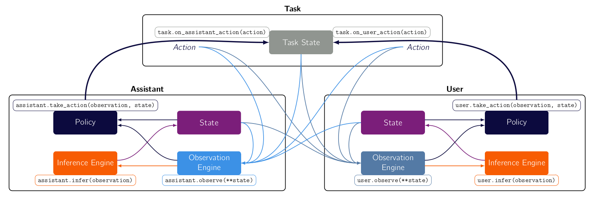

.. bundles:

Bundles
==================

.. start-quickstart-bundle

Bundles are the objects that compose the three main components (task, user and assistant) into a game. It forms the joint state, collects the rewards and ensure synchronous sequential sequences of observations, inferences and actions of the two agents. 

They are useful because they allow you to orchestrate the interaction how you want it.

In most cases, there is no need to define a new Bundle, and you can straightaway use the standard existing ``Bundle``. For example, you can create a bundle and interact with it like so: 

.. literalinclude:: ../../coopihc/examples/basic_examples/bundle_examples.py
    :language: python
    :linenos:
    :start-after: [start-check-taskuser]
    :end-before: [end-check-taskuser]

.. end-quickstart-bundle

Overview of Bundle mechanisms
-------------------------------

The main API methods are the same as gym's, although their functionality is extended.

* ``reset``, which allows you to have control which components you reset and how you reset them.
* ``step``, which allows you to specify how agents select their actions, and how many turns to play .
* ``render``, which combines all rendering methods of the components.
* ``close``, which closes the bundle properly.

The following graphic explicits how the most important options work

.. image:: images/turns.png
    :align: center
    :width: 800

Stepping through a Bundle
-----------------------------
The bundle directs the order of operations. Two important concepts are turns and rounds:

* There are 4 turns (see interaction model):
    0. user prepares action (by creating observations and updating its internal state)
    1. user takes action 
    2. assistant prepares action
    3. assistant takes action

* A round is the sequence of these 4 turns.

There are several ways in which you can indicate how to move the bundle from a state in a given round and turn to another.

Moving rounds 
^^^^^^^^^^^^^^^

To move rounds, you can simply call ``step(user_action= None, assistant_action = None, go_to=None)``. This will move the bundle from turn T and round R to turn T and round T+1, by having the 4 turns be executed. If ``user_action=None``, then the user action is sampled from its policy engine. Otherwise, the provided action is used. This allows you to test the effect of a different policy on the same agent straightforwardly. The same holds for the assistant. If ``go_to = k``, then the turns will be played until the turn k is reached without completing the full round.  

Moving turns 
^^^^^^^^^^^^^^^

- **quarter steps.** The simplest is the ``quarter_step`` method, which just wraps the step method so that it advances exactly one turn:

.. code-block:: python

    # e.g. in turn 0, round 3
    bundle.quarter_step() # turn 1 round 3
    bundle.quarter_step() # query action from user policy engine, turn 2, round3
    bundle.quarter_step() # turn 3 round 3
    bundle.quarter_step(assistant_action = 1) # turn 0 round 4, use action '1' instead of querying from assistant_policy_engine

    ## equivalent to 
    bundle.step(assistant_action = 1)

- **triggered from agent.** Each quarter step can also be triggered directly from the agent (and not the bundle), in a flexible way, allowing various effects on the actual bundle.

    + ``agent.prepare_action(affect_bundle=True, game_state=None, agent_observation=None, increment_turn=True)`` will prepare the action, i.e. equivalent to moving from turn 0 to 1. 
        * if ``increment_turn=True``, the turn number of the bundle is incremented by 1
        * if ``game_state`` and ``agent_observation`` are given, then these will be used to prepare the action, otherwise the agent will use values internal to the bundle. 
        * if ``affect_bundle = False``, then the produced observation and the new internal state are not propagated to the bundle. This allows you to query your agent even though it is inside a bundle, without affecting the bundle.
        * By default, ``agent.prepare_action()`` is equivalent to the ``quarter_step`` between turns 0 and 1, and 2 and 3.

    + ``agent.take_action(agent_observation=None, agent_state=None, increment_turn=True, update_action_state=True)`` will query the agent's policy engine. 
        * if ``increment_turn=True``, the turn number of the bundle is incremented by 1
        * if ``agent_state`` and ``agent_observation`` are given, then these will be used to select the action, otherwise the agent will use values internal to the bundle. 
        * if ``update_action_state = True``, then the produced action is propagated to the bundle. This allows you to query your agent even though it is inside a bundle, without affecting the bundle.

- **being even more precise.** You can also access the workings of each component at a more precise level:
    .. code-block:: python

        ## 0->1 equivalent to bundle.quarter_step()
        obs, reward = user.observe(affect_bundle=True)
        state, reward = user.infer(affect_bundle=True, increment_turn=True)

        ## 1->2 equivalent to bundle.quarter_step()
        action, reward = user.take_action(
            increment_turn=True, task_transition=True
        )
       

