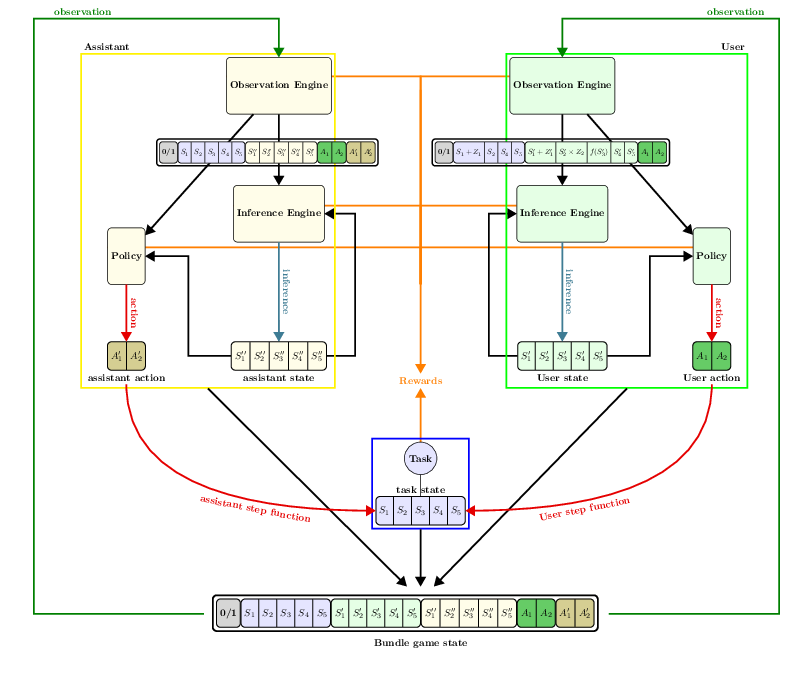

.. interaction_model:

The Interaction Model
======================
This library was written with the idea that the successful interaction between a human and a computer is essentially a problem of **cooperation**.

Commitments and Assumptions
-----------------------------

We make the following theoretical commitments:

* Users go through states (e.g. preferences, mental fatigue)

* User observations are incomplete

* Communication between users and computers benefits interaction

* Users are (imperfectly) rational

* Users maintain internal models of their environment

* Systems may also, and will usually benefit from maintaining internal models of the user

* Users and systems adapt to each other

* User behavior is driven by scalar rewards

* Efficient system behavior can be attained by maximizing scalar rewards

* At a high level, the user model and systems are symmetric and characterized by an ability to make observations, make inferences and produce actions.

At a high level, *CoopIHC* builds on a model of user assistance (See Fig. 1), where a user and an assistant work together to drive the task toward a goal state:

* There is a task which can be represented by a state :math:`s_T`,
* An user wants to drive the task to a goal state,
* An assistant is here to help (assist) the user achieve this.

The model further assumes that the user and assistant act sequentially (one after the other).

.. _interaction_model_fig_label:

.. tikz:: Model of user assistance
    :include: tikz/interaction_model.tikz
    :xscale: 80
    :align: center

    The graphical interaction model used in *CoopIHC*

Both the user and assistant (generically referred to as **agents**) are fundamentally described by their ability to produce observations, make inferences and take actions:

1. They have an internal state (:math:`s_U` and :math:`s_A` for respectively the user and the assistant), which stores e.g. goals, preferences, model parameters.
2. They observe (perfectly or partially) the various states of the  interaction model. When making an observation (:math:`o_U` and :math:`o_A`), the agents receive a reward e.g. because that observation may take some time to be created (negative reward), or satisfies a curiosity (positive reward).
3. Based on these observations, they make inferences that change their internal states. The agents again receive a reward, since there can be a cost to inferring (e.g. mental effort, computational resources) or a benefit (e.g. satisfaction).
4. Based on their internal states and their observations, they take actions (:math:`a_O` and :math:`a_A`) via a policy. Those actions may have an effect on the other states (e.g. the task state) of the interaction model.

.. tikz:: Order of Sequential Operations
    :include: tikz/sequential_operations.tikz
    :xscale: 50
    :align: center

.. note::

    The sequential nature of actions is not a strong assumption: simultaneous play can always be achieved by delaying the effect of the one's action to the other's turn. Furthermore, it can be argued that no real simultaneous play is ever possible.

Library Architecture
------------------------

The resulting architecture of the library that integrates the interaction model is displayed below.

* All states of the model are joined into a single **game state**.
* Observations are produced by **observation engines** from the game state.
* Inferences are made by **inference engines**, using the current agent's internal state and observation as input.
* Actions are taken by **policies**, using the current agent's internal state and observation as input.
* User and assistant actions make the task transition from one state to another.
* All these components may issue rewards, which are collected.

    The general architecture of an interaction context as described in *CoopIHC*

When using the library, you will need to specify states as well as observation engines, inference engines and policies. You can reuse existing components if available or implement your own.

Decision-Theoretic Models
--------------------------
The model of user assistance can be formulated as a Partially Observable Stochastic Game (POSG). POSGs are one of the most general models of decision making and represent sequential decision making for *multiple agents* in a *stochastic* environment with *imperfect observability*. POSGs admit many special cases (see Table 1), including the well-known MDP. The interaction context can be expressed as each one of these using an appropriate :doc:`bundle`.

.. list-table:: POSG and subclasses of POSG
    :widths: auto
    :header-rows: 1

    * - Observation
      - Single-Agent
      - Multi-Agent
      -
    * - Perfect
      - MDP
      - MMDP
      - same reward
    * -
      -
      - Markov Games
      - different reward
    * - Imperfect
      - POMDP
      - Dec-POMDP
      - same reward
    * -
      -
      - POSG
      - different reward
