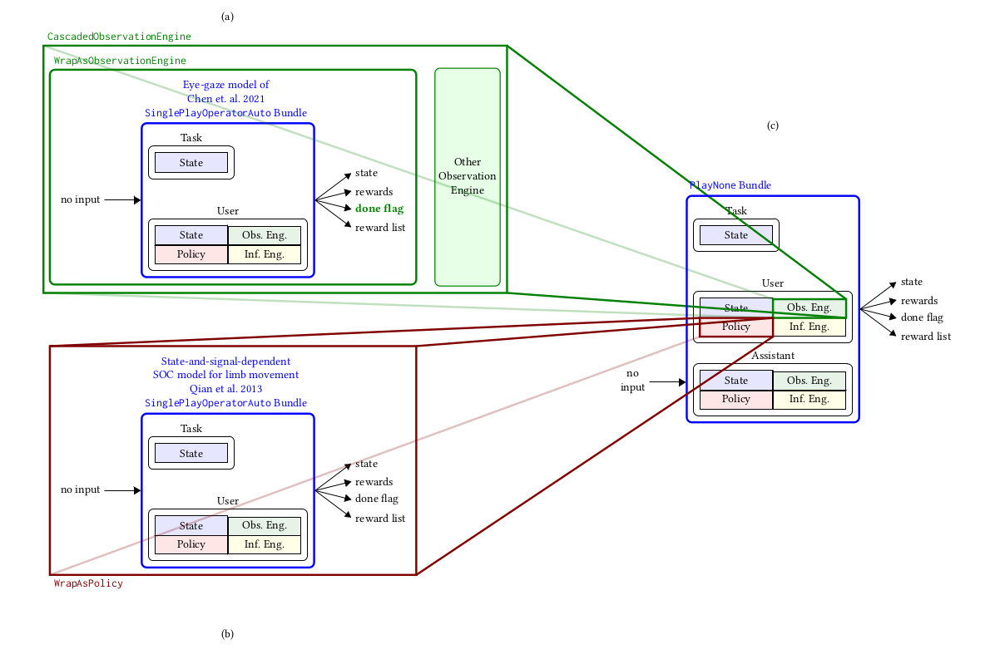

.. modularity:

Modularity
===============

As we have seen, you can create new classes from scratch, by subclassing one of the coopihc classes, adding a few methods, and adhering to a few conventions.

Another way in which one can create new classes is by re-using existing models or components and wrapping them appropriately.
In this example we present a fully worked example where a complex sequence of interactions is described in a relatively simple manner using relatively few lines of code, and by maximally re-using existing code.

Description of the example
------------------------------

In the :doc:`previous example <more_complex_example>`, we presented a BIG assistant which would assist a user in selecting a target. While proving more efficient than the unassisted version, that evaluation might have been biased: since the user cannot predict the next position of the cursor when using the BIG assistant, it needs to locate the target which is costly. This cost had not been accounted for, which somewhat inflates our evaluation of BIGGain. In this example, we re-use an existing bundle that was made to model eye movements, and incorporate it to our user model, to simulate the time it takes to find the cursor.

The steps in this example are:

1. Definition of a Bundle that describes how the eye displaces its fovea to locate a target
2. After each assistant intervention, the cursor jumps to a new unexpected location. We are going to use the foveal vision bundle to simulate the time it takes to relocate the cursor, by resetting the foveal vision to the state after the intervention, and wrap it up into an observation engine.
3. The previous observation engine only deals with cursor information, but not the other information. We are going to cascade the old default engine and the new observation engine into a single one.
4. This new cascaded observation engine is used instead of the old one in the user model.

Eye-movement model
--------------------

We start off from a model of foveal vision which specifies how the eye can locate a target through displacement of the fovea. This model is adapted from [Chen2021]_ and is available in the CoopIHC-zoo `eye-repository <https://github.com/jgori-ouistiti/CoopIHC-zoo/tree/main/coopihczoo/eye>`_.

Without going in to the details, the model explains how beliefs about where the target might be is refined by successive jumps from the fovea.

1. The controller of the fovea holds a belief regarding where the target might be located in the space.
2. A target outside of the foveal area (a small ellipsis) is visible but through noisy observations, where the further away from that ellipsis the noisier it is.
3. Based on that information, the controller decides on the new foveal position. However, when moving, signal-dependent motor noise affects the actual position (the higher the amplitude of foveal movement, the higher the amplitude of the noise).

As usual, we define a bundle by pairing the user model with a task.

.. code-block:: python

    from coopihczoo.eye.envs import ChenEyePointingTask
    from coopihczoo.eye.users import ChenEye

    from coopihc.bundle.Bundle import Bundle

    # Parameters tuned on empirical data
    fitts_W = 4e-2
    fitts_D = 0.8
    perceptualnoise = 0.2
    oculomotornoise = 0.2

    # Models and tasks
    task = ChenEyePointingTask(fitts_W, fitts_D, dimension=1)
    user = ChenEye(perceptualnoise, oculomotornoise, dimension=1)
    obs_bundle = Bundle(task=task, user=user)

A render of the various states is shown below (for the 2D version, more easily interpretable), where the red circle is the target, the green circle the current position of the fovea and the red start the current mean belief about target location. The user render also shows the beliefs confidence ellipses. 

.. image:: images/cheneye2d_0.png
    :width: 49%

.. image:: images/cheneye2d_2.png
    :width: 49%

Adapting the existing task
^^^^^^^^^^^^^^^^^^^^^^^^^^^^^^^
The task that is solved by the bundle just above is to position the eye on top of the target. Basically, the cursor position before assistance provides the starting point, while the cursor position after assistance (and potentially a jump) provides the target. 
We will then let the bundle play out in time, finding the cursor in some number of steps.

We therefore add a state to the task for the old position of the cursor, leaving the rest of the logic unchanged

.. code-block:: python

    class oldpositionMemorizedSimplePointingTask(SimplePointingTask):
        def __init__(self, *args, **kwargs):
            super().__init__(*args, **kwargs)
            self.memorized = None

        def reset(self, dic={}):
            super().reset(dic=dic)
            self.state["oldposition"] = copy.deepcopy(self.state["position"])

        def user_step(self, *args, **kwargs):
            self.memorized = copy.deepcopy(self.state["position"])
            obs, rewards, is_done = super().user_step(*args, **kwargs)
            obs["oldposition"] = self.memorized
            return obs, rewards, is_done

        def assistant_step(self, *args, **kwargs):
            self.memorized = copy.deepcopy(self.state["position"])
            obs, rewards, is_done = super().assistant_step(*args, **kwargs)
            obs["oldposition"] = self.memorized
            return obs, rewards, is_done

    pointing_task = oldpositionMemorizedSimplePointingTask(
        gridsize=31, number_of_targets=8, mode="position"
    )

The Observation Engine
^^^^^^^^^^^^^^^^^^^^^^^
The crux of the method here is to wrap the bundle previously defined into an observation engine. As explained in :doc:`observation_engine`, the only constraint for an observation engine is that it subclasses an existing ``ObservationEngine`` and defines an ``observe`` method with the right signature. Here we subclass from ``WrapAsObservationEngine``, which is exactly made for this purpose (i.e. when you need to define an observation engine from a bundle).

.. code-block:: python

    from coopihc import WrapAsObservationEngine

    class ChenEyeObservationEngineWrapper(WrapAsObservationEngine):
        def __init__(self, obs_bundle):
            super().__init__(obs_bundle)

        def observe(self, game_state):

            # Deal with the case where the cursor is in the same position as the target. While this would never happen with a continuous model like in the eye model, the discrete pointing model here can lead to distance of zero, which leads to singular matrices later on. 
            if (
                game_state["task_state"]["position"]
                == game_state["task_state"]["oldposition"]
            ):
                return game_state, -1 

            # set observation bundle to the right state and cast it to the right space. See the StateElement entry in the API Reference to read more about cast
            target = game_state["task_state"]["position"].cast(
                self.game_state["task_state"]["target"]
            )
            fixation = game_state["task_state"]["oldposition"].cast(
                self.game_state["task_state"]["fixation"]
            )

            # Now that the target and initial fixation have been determined, we can reset the eye bundle to that specific situation, via a forced reset
            reset_dic = {"task_state": {"target": target, "fixation": fixation}}
            self.reset(dic=reset_dic, turn=0)

            # Actually play the eye game
            is_done = False
            rewards = 0
            while True:
                obs, reward_dic, is_done = self.step()
                rewards += sum(reward_dic.values())
                if is_done:
                    break

            # cast back to initial space and return
            obs["task_state"]["fixation"].cast(game_state["task_state"]["oldposition"])
            obs["task_state"]["target"].cast(game_state["task_state"]["position"])

            return game_state, rewards

.. note::

    Notice the use of the cast and forced reset mechanisms, which are documented in the API Reference, and should prove very useful.

This engine specifically attributes a cost to observing the cursor. To combine it with the existing observation engine (which observes the targets etc.), we use another observation engine specifically made to combine other observation engines serially, namely a ``CascadedObservationEngine``.

.. code-block:: python

    from coopihc.observation.RuleObservationEngine import RuleObservationEngine
    from coopihc.observation.CascadedObservationEngine import CascadedObservationEngine
    from coopihc.observation.utils import base_user_engine_specification

    # Define cascaded observation engine
    cursor_tracker = ChenEyeObservationEngineWrapper(obs_bundle)

    default_observation_engine = RuleObservationEngine(
        deterministic_specification=base_user_engine_specification,
    )
    new_observation_engine = CascadedObservationEngine(
        [cursor_tracker, default_observation_engine]
    )

Assembling everything
^^^^^^^^^^^^^^^^^^^^^^^^^
We can now assemble everything: First, we reload the user model, but plug in our new observation engine. Then, we repeat the same process as before, bundling the user model with BIGGain and playing an episode of the game.

.. code-block:: python

    from coopihczoo.pointing.users import CarefulPointer
    from coopihczoo.pointing.assistants import BIGGain

    binary_user = CarefulPointer(override_observation_engine=(new_observation_engine, {})) # Override the old observation engine and plug in our new one.
    BIGpointer = BIGGain()

    bundle = Bundle(task=pointing_task, user=binary_user, assistant=BIGpointer)
    game_state = bundle.reset(turn=1)
    bundle.render("plotext")
    reward_list = []
    while True:
        obs, rewards, is_done = bundle.step()
        reward_list.append(rewards)
        bundle.render("plotext")
        if is_done:
            break

.. [Chen2021] Chen, Xiuli, et al. "An adaptive model of gaze-based selection." Proceedings of the 2021 CHI Conference on Human Factors in Computing Systems. 2021.