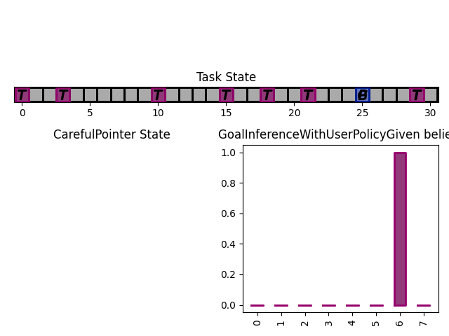

.. more_complex_example:

Basic Example
-----------------
We are going to build a fully working bundle, with a task, a user model, and an assistant. The user's task is to position a cursor on top of a goal. The assistant will help the user by modulating the user's action (i.e. multiplying its action by a scalar value, chosen by the assistant).

Task
^^^^^^
Creating a new task can be done by subclassing ``InteractionTask`` (see :doc:`tasks` for more information).
We first define the ``__init__`` method, where we define the size of the gridworld in which the cursor moves, as well as the number of targets in that gridworld. We also add two components to the task state: Position, and Targets, which respectively hold the information about cursor and targets positions.

.. code-block:: python

    from coopihc.interactiontask import InteractionTask
    from coopihc.space import StateElement
    import gym
    import numpy

    class ExampleTask(InteractionTask):
        """ExampleTask with two agents. A cursor is moved from a given position through the multiplication of the actions of a simulated user and an assistant.
        """
        def __init__(self, gridsize = 10, number_of_targets = 2):
            # Call super().__init__() before anything else, which initializes some useful attributes, including a State (self.state) for the task
            super().__init__()

            # Store invariant parameters as attributes
            self.gridsize = gridsize
            self.number_of_targets = number_of_targets

            # Store other parameters in State
            self.state['Position'] = StateElement(values = None, spaces = [gym.spaces.Discrete(gridsize)], possible_values = None)
            self.state['Targets'] = StateElement(values = None, spaces = [gym.spaces.Discrete(gridsize) for i in range(self.number_of_targets)], possible_values = None)

We then define a reset method, that changes the initial state of the task.

.. code-block:: python

    def reset(self, dic = None):
        # Pick random targets, and a starting position (all different)
        locations = sorted(numpy.random.choice(list(range(self.gridsize)), size = self.number_of_targets +1, replace = False))
        targets, position, goal = locations[:-2], locations[-2], locations[-1]
        self.state['Targets']['values'] = targets
        self.state['Position']['values'] = position
        self.goal = goal
        # for render (see later)
        self.grid = [' ' for i in range(self.gridsize)]
        for i in targets:
            self.grid[i] = 'T'
        super().reset(dic)

We also define two methods that describe how the state of the task transitions to another upon an action by the operator or the assistant.

.. code-block:: python

    def operator_step(self, *args, **kwargs):
        # do nothing
        return super().operator_step()

    def assistant_step(self, *args, **kwargs):
        # Call super method before anything else
        super().assistant_step()

        is_done = False

        # Look up needed inputs in the game state, and use the special 'human_values' key to convert to human readable values
        assistant_action = self.bundle.game_state['assistant_action']['action']['human_values'][0]
        operator_action = self.bundle.game_state['operator_action']['action']['human_values'][0]
        position = self.state['Position']['human_values'][0]

        # Apply modulation, with rounding and clipping.
        self.state['Position']['values'] = [int(numpy.clip(numpy.round(position + operator_action*assistant_action, decimals = 0), 0, self.gridsize-1))]

        # Check if the Goal is attained
        if self.state['Position']['human_values'][0] == self.goal:
            is_done = True
        return self.state, -1/2, is_done, {}

Finally, add a render method to print the gridworld.

.. code-block:: python

    def render(self,*args, mode="text"):

        self.grid[self.goal] = 'G'
        if 'text' in mode:
            tmp = self.grid.copy()
            tmp[int(self.state['Position']['human_values'][0])] = 'P'
            _str = "|"
            for t in tmp:
                _str += t + "|"

            print('\n')
            print("Turn number {:f}".format(self.turn))
            print(_str)

            targets = sorted(self.state['Targets']['human_values'])
            print('Targets:')
            print(targets)
            print("\n")
        else:
            raise NotImplementedError

We can now instantiate our task, and observe its state

.. code-block:: python

    >>> task = ExampleTask(gridsize = 15, number_of_targets = 3)
    >>> print(task.state)
    State 0x140517994199512 of type <class 'coopihc.space.State'>
    Position:
    value:	[None]
    spaces:	[Discrete(15)]
    possible values:	[[None]]

    Targets:
    value:	[None, None, None]
    spaces:	[Discrete(15), Discrete(15), Discrete(15)]
    possible values:	[[None], [None], [None]]

We see that the Position substate has not been attributed a value yet, but can take any value from 0 to 14 (Discrete(15)). The field possible values is unused here (it is in case a mapping is needed from [0,N] to another range, see :py:mod:`State <coopihc.space.State.State>` for more information). Similarly, we see that the Targets substate has a length 3 vector of Nones, indicating that it expects three values to be filled, each contained in Discrete(15). Calling reset will attribute value to the states:

.. code-block:: python

    >>> task.reset()
    >>> print(task.state)
    State 0x140517994199512 of type <class 'coopihc.space.State'>
    Position:
    value:	[11]
    spaces:	[Discrete(15)]
    possible values:	[[None]]

    Targets:
    value:	[3, 4, 7]
    spaces:	[Discrete(15), Discrete(15), Discrete(15)]
    possible values:	[[None], [None], [None]]

Targets and cursor position have been set. To verify that the task behaves as intended, we should couple it with two other agents that provide actions. However, for now, we have no agents yet that are capable of interacting with this task. To help in developing tasks, *CoopIHC* introduces a bundle called ``_DevelopTask`` which allows one to wrap a task in a bundle without specifying any agents. Actions are provided manually via a step method. This also allows one to call render.

.. code-block:: python

    >>> from coopihc.bundle import _DevelopTask
    >>> bundle = _DevelopTask(task)
    >>> bundle.render("text")
    Task Render

    Turn number 0.000000
    | | | |T|T| | |T| | | |P| |G| |
    Targets:
    [3, 4, 7]

    Operator Render
    DummyOperator State
    Assistant Render
    DummyAssistant State
    >>> bundle.step([-1,1])
    >>> bundle.render("text")
    Task Render

    Turn number 1.000000
    | | | |T|T| | |T| | |P| | |G| |
    Targets:
    [3, 4, 7]

    Operator Render
    DummyOperator State
    Assistant Render
    DummyAssistant State

We first see the bundle render, with the task operator and assistant renders. We see the print out of the gridworld as specified in our task render method, as well as the renders of the other agents (here, these are so called dummies, since we used the specific _DevelopTask bundle). We then provide a pair (operator, assistant action). Here, the expected outcome is to move one unit to the left (-1 times 1). The new render shows that indeed the position of the cursor was shifted by one unit to the left.

The full code for this part is found in :download:`this script <code/zerotask.py>`. Usually, we would want the operator to set the goal of the task, and not the task itself. The operator also needs to pick actions based on the current state of the game. See next how this is achieved.

Operator
^^^^^^^^^^
An operator is made of 4 components:

* A ``State``, which contains parameters that vary (just like for the task)
* An ``ObservationEngine``, which specifies how the game state is transformed into an observation
* An ``InferenceEngine``, which specifies how the operator's state should be modified based on the newest observations
* A ``Policy``, which describes how the operator is going to take actions, based on the value of its state as well as its latest observations.

Defining an operator involves subclassing the ``BaseAgent`` class and specifying those 4 components (each of which can be set to None).

Let us first fill in the State (accessible as ``self.state``); an immediate difficulty is that one cannot define the substate 'Goal' without knowing the task, since the goal will depend on the size of the gridworld, the available targets and so forth.
This problem is very common, since usually agent will have to adapt to the task. Because of that, *CoopIHC* introduces a method called ``finit()`` which is called by the bundle after the task and agents have been instantiated, see :doc:`bundles` for more information on the initialization of a bundle.

.. code-block:: python

    from coopihc.agents import BaseAgent
    from coopihc.space import State, StateElement
    import gym

    class CarefulPointer(BaseAgent):

        def __init__(self):
            # fill in later

        def finit(self):
            target_values = self.bundle.task.state['Targets']['values']
            target_spaces = self.bundle.task.state['Targets']['spaces']
            self.state['Goal'] =  StateElement( values = None,
                                                spaces = [gym.spaces.Discrete(len(target_spaces))],
                                                possible_values = [target_values])

        def reset(self, *args):
            self.finit()
            super().reset(*args)

Notice two things here:

* Goals take values in the set of possible targets; this is indicated by the fact that possible_values has been filled in with all possible values for the Goal.

* The actual value of the Goal has been left empty. It is the reset's method job to put a value there, which should usually be different upon each call to reset. This is achieved here by calling the reset method from the parent class ``BaseAgent``, which fills the state with values sampled randomly from each state's component's spaces attribute.

Now, let's turn to the observation engine, whose goal is to provide partial observations from the common game state. Essentially, the observation engine is an object with an ``observe`` method, which modifies the game state (e.g. removing some of the substates, altering others).
*CoopIHC* defines several observation engines. The most common one is a rule-based observation engine, where the modeler specifies some deterministic or probabilistic rules to be applied to the game state.
We can define observation rules on a macro level, which indicate which substates are observable by the agent, and then add specific micro rules on top. More details can be found in :doc:`observation_engine`.
Here, we will assume that the operator can see everything, except the state of the assistant:

.. code-block:: python

    # ---------- Observation engine ------------
    # Macro specification
    base_operator_engine_specification  =    [ ('turn_index', 'all'),
                                        ('task_state', 'all'),
                                        ('operator_state', 'all'),
                                        ('assistant_state', None),
                                        ('operator_action', 'all'),
                                        ('assistant_action', 'all')

                                        ]
    # Additional deterministic and probabilistic micro rules that can be added to the engine: for example, to add noise to a component, or to target one component in particular. Here, we will need none.
    extradeterministicrules = {}
    extraprobabilisticrules = {}

    # Instantiate an observation_engine defined by rules:
    observation_engine = RuleObservationEngine(
                deterministic_specification = base_operator_engine_specification,
                extradeterministicrules = extradeterministicrules,
                extraprobabilisticrules = extraprobabilisticrules   )

Let's now turn to the inference engine. Since here the goal of the operator (and thus, its state) will not change during the episode, there is no need for an inference engine and we can simply not provide it during initialization. Nothing special needs to be undertaken here, as *CoopIHC* will handle this case behind the scenes.

Finally, let's turn to the policy for the operator. A policy is essentially an object with a ``sample`` method, which specifies how the agent's action is chosen with respect to the current state and observation of the agent.
For this simple scenario, we will consider an operator that indicates either -1 (left) or +1 (right). We will also consider that the probabilities with which the operator will take a particular action given its goal and the cursor position are explicit, i.e. we have an explicit model of the user that we can use to specify the operator. A predefined policy ``ELLDiscretePolicy`` exists (see :doc:`policy`) for such cases, which stands for discrete policy with explicit likelihood.

To use this policy, one only has to describe the model, i.e. inform the policy about the likelihood of each action given the current observation. The ``ELLDiscretePolicy`` then samples an action in line with the probabilities described in the model. Below, we first initialize the policy, before defining the user model and attaching it to the policy.

.. code-block:: python

    agent_policy = ELLDiscretePolicy(action_space = [gym.spaces.Discrete(2)], action_set = [[-1, 1]])

    def user_model(self, action, observation):
        # convert actions and observations
        action = action['human_values'][0]
        goal = observation['operator_state']['Goal']['human_values'][0]
        position = observation['task_state']['Position']['human_values'][0]

        # Write down all possible cases (5)
        # (1) Goal to the right, positive action
        if goal > position and action > 0 :
            return .99
        # (2) Goal to the right, negative action
        elif goal > position and action < 0 :
            return .01
        # (3) Goal to the left, positive action
        if goal < position and action > 0 :
            return .01
        # (4) Goal to the left, negative action
        elif goal < position and action < 0 :
            return .99
        elif goal == position:
            return 0
        else:
            raise RunTimeError("warning, unable to compute likelihood. You may have not covered all cases in the likelihood definition")

    # Attach user model to the policy
    agent_policy.attach_likelihood_function(user_model)

All elements having been defined, we can now instantiate our first agent. We first define its role, and then plug in our (up to 4) components

.. code-block:: python

    super().__init__(
                'operator',
                policy = agent_policy,
                observation_engine = observation_engine
                )

The full definition of this operator can be found by looking at the ``CarefulPointer`` class in the CoopIHC-Zoo_. 
Assistant
^^^^^^^^^^
We are going to couple this operator with a so-called constant CD gain (a constant action is used for the modulation, whatever the operator input).

.. code-block:: python

    class ConstantCDGain(BaseAgent):

        def __init__(self, gain):
            self.gain = gain
            action_space = [gym.spaces.Discrete(1)]
            action_set = [[gain]]
            agent_policy = Policy(action_space = action_space, action_set = action_set)

            super().__init__( 'assistant',
                                    policy = agent_policy,
                                    observation_engine = None,
                                    inference_engine = None
                                    )

Here, we make use of ``Policy`` which all policies should inherit from, and which samples actions at random (which is not a problem, since there is only one action in this case). No observation nor inferences engines nor states are needed here.

Bundles
^^^^^^^^^
Now that all components of the task are ready, we can bundle them together. The first thing we can check is whether our components work as intended, by wrapping them up into a ``PlayNone`` bundle, in which case the actions of the agents are sampled from their policies.

.. code-block:: python

    from pointing.envs import SimplePointingTask
    from pointing.operators import CarefulPointer
    from pointing.assistants import ConstantCDGain

    from coopihc.bundle import PlayNone

    task = SimplePointingTask(gridsize = 31, number_of_targets = 8)
    binary_operator = CarefulPointer()
    unitcdgain = ConstantCDGain(1)

    bundle = PlayNone(task, binary_operator, unitcdgain)
    game_state = bundle.reset()
    bundle.render('plotext')
    while True:
        sum_rewards, is_done, rewards = bundle.step()
        bundle.render('plotext')
        if is_done:
            bundle.close()
            break

We can also play around as operator or as assistant. For example, suppose we are in the business of improving assistant policies. With the unit CD gain assistant, the number of steps needed to get to the goal is exactly that of the initial distance between the cursor and the goal.

We can come up with a more effective form of assistance.
For example, let's try out a simple rule with adaptive gain. The gain is set at some high value. Each time the operator moves past the goal, he will change directions, in which case the assistant will halve the gain (1 being the minimum)

.. code-block:: python

    task = SimplePointingTask(gridsize = 31, number_of_targets = 10)
    operator = CarefulPointer()
    assistant = ConstantCDGain(1)

    bundle = PlayAssistant(task, operator, assistant)

    game_state = bundle.reset()
    bundle.render('plotext')
    # The heuristic is as follows: Start with a high gain. The operator should always give the same action. If at some point it changes, it means the operator went past the target and that the cursor is very close to the target. If that is the case, divide the gain by 2, but never less than 1.

    # Start off with a high gain
    gain = 4
    # init for the adaptive algorithm
    sign_flag = game_state["operator_action"]['action']['human_values'][0]
    observation = game_state
    _return = 0
    while True:
        # Check whether the operator action changed:
        sign_flag = sign_flag * observation["operator_action"]['action']['human_values'][0]
        # If so, divide gain by 2
        if sign_flag == -1:
            gain = max(1,gain/2)
        # Apply assistant action
        observation, sum_rewards, is_done, rewards = bundle.step([gain])
        _return += sum_rewards
        bundle.render('plotext')
        if is_done:
            bundle.close()
            break

Run this multiple times and compare with the previous case and see that the returns are much better than what one would get with the constant CD gain.
Now, you could explore other policies, or better, use an optimization process to find the best policy (and use the bundle to give you the return on policy). This simple example sketches one use of *CoopIHC*, namely the design of intelligent assistants.

.. note::

    Add here an example where the policy of the user is obtained by RL

More complex example
-------------------------

We will use the previous user model and combine it with a more complex assistant, namely a Bayesian Information Gain (:download:`BIG <https://hal.inria.fr/hal-01677122/document>`) Assistant. The idea of a BIG is that the assistant extracts as much information as possible from the user at each step. Roughly speaking, it will position the cursor somewhat in between the most probable targets.

To do so, it maintains a model of the user, to associate a probability with each target being the goal. These probabilities will be stored in the assistant's state, and updated by a specific inference engine.
It then uses a metric based on mutual information to position the cursor 'in between' the most likely targets. The metric and the decision based upon will be computed by a specific policy.

The Inference Engine
^^^^^^^^^^^^^^^^^^^^^^^^
The inference engine that we will use here is called :doc:`GoalInferenceWithOperatorPolicyGiven <inference_engine>`. As the name suggests, it is a generic engine which infers a goal :math:`\theta` from a candidate set of possible goals , and where the operator policy (the user) model is known. This exactly fits our problem of assigning probabilities to targets to determine the user's goal.

This engine expects to be initialized with

* a ``set_theta``, the set of potential goal states
* a model of the user policy. This policy can be either the true policy of the user, or any other model (the greater the mismatch between the true policy and the model policy, the lower the performance of the assistant). In this example, we use the true policy, but usually the user policy is unknown, and has to be either learned or approximated.

We initialize our agent by subclassing ``BaseAgent`` and providing the inference engine, then attach the  operator policy to it once the bundling has begone.
This inference engine expects that the agent maintains a substate called 'Beliefs' which it will use to store and update the probabilities of each member of the candidate set being the goal. This belief vector is initialized uniformly upon each reset of the bundle. The candidate set is also provided upon each reset, since the potential targets change upon each reset.

Representing only the inference engine part, we have:

.. code-block:: python

    class BIGGain(BaseAgent):
        def __init__(self):

            super().__init__(       'assistant',
                                    inference_engine = GoalInferenceWithOperatorPolicyGiven()
                                    )

        def finit(self):

            operator_policy_model = self.bundle.operator.policy
            self.inference_engine.attach_policy(agent_policy.operator_policy_model)

        def reset(self, *args):

            self.state['Beliefs'] = StateElement(values = [1/self.bundle.task.number_of_targets for i in range(self.bundle.task.number_of_targets)], spaces = [gym.spaces.Box(0, 1, shape = (1,)) for i in range(self.bundle.task.number_of_targets)], possible_values = None)

            # change theta for inference engine
            set_theta = [{('operator_state', 'Goal'): StateElement(values = [t],
                    spaces = [gym.spaces.Discrete(self.bundle.task.number_of_targets)],
                    possible_values =  self.bundle.task.state['Targets']['values'])  } for t in range(self.bundle.task.number_of_targets) ]

            self.inference_engine.attach_set_theta(set_theta)

The Policy
^^^^^^^^^^^^
The BIG policy works by estimating the information that will be gained by an assistant at the next operator action, and does so for each of its own possible actions. It then selects the action that will be most informative at the next step. Therefore, it requires a transition function (how will the state change after an assistant action). It also requires a model of the user policy as well as the ``set_theta`` used in the inference engine.

Representing only the policy part, we have:

.. code-block:: python

    class BIGGain(BaseAgent):
        def __init__(self):

            super().__init__(       'assistant'
                                    )

        def finit(self):

            assistant_action_set =      list(range(self.bundle.task.gridsize))
            assistant_action_space = [gym.spaces.Discrete(self.bundle.task.gridsize)]
            operator_policy_model = self.bundle.operator.policy

            action_state = self.bundle.game_state['assistant_action']
            agent_policy = BIGDiscretePolicy(       action_state,
                                                    assistant_action_space,
                                                    assistant_action_set,
                                                    operator_policy_model                                                )

            self.attach_policy(agent_policy)

        def reset(self, *args):

            set_theta = [{('operator_state', 'Goal'): StateElement(values = [t],
                    spaces = [gym.spaces.Discrete(self.bundle.task.number_of_targets)],
                    possible_values =  self.bundle.task.state['Targets']['values'])  } for t in range(self.bundle.task.number_of_targets) ]

            self.policy.attach_set_theta(set_theta)

            # define a transition function
            def transition_function(assistant_action, observation):
                """ What future observation will the user see due to assistant action
                """
                # always do this for any BIG
                observation['assistant_action']['action'] = assistant_action
                # specific to BIGGain
                observation['task_state']['Position'] = assistant_action
                return observation

            self.policy.attach_transition_function(transition_function)

The full code for this assistant, (obtained by merging the two segments above, as well as a call to the inference engines render method) can be found in the CoopIHC-Zoo_

Bundles
^^^^^^^^^

We can encode this behavior into a new assistant and use bundles again (with two new imports)

.. code-block:: python

    from pointing.assistants import BIGGain
    import matplotlib.pyplot as plt

    task = SimplePointingTask(gridsize = 31, number_of_targets = 10, mode = 'position')
    binary_operator = CarefulPointer()

    BIGpointer = BIGGain()

    bundle = PlayNone(task, binary_operator, BIGpointer)

    game_state = bundle.reset()
    bundle.render('plotext')
    plt.tight_layout()

    while True:
        sum_rewards, is_done, rewards = bundle.step()
        bundle.render('plotext')
        if is_done:
            break

This assistant has very good performance. The figures below show a run, which finished in 3 steps. The task state as well as the internal states of the assistant and operator are shown. The operator's state is empty, since we did not define a render method for the ``CarefulPointer``. The assistant's render calls the inference engine's render, which displays the belief associated with each member of the candidate set.

.. image:: images/biggain_0.png
    :width: 49%

.. image:: images/biggain_1.png
    :width: 49%

.. image:: images/biggain_2.png
    :width: 49%

.. warning::

    From here the doc is outdated

The BIGGain assistant, while giving good performance, does not minimize the number of steps needed to achieve the goal. We can try to get a better performing operator/assistant couple using Reinforcement Learning. To do this, simply wrap up the bundle ``Train`` and use an off-the-shelf RL algorithm:

.. code-block:: python

    task = SimplePointingTask(gridsize = 31, number_of_targets = 10)
    operator = CarefulPointer()
    assistant = ConstantCDGain(1)

    bundle = PlayAssistant(task, operator, assistant)
    env = Train(bundle)
    check_env(env)

The ``check_env`` method makes sure the environment is compatible with open AI's gym API.

.. _CoopIHC-Zoo: <https://jgori-ouistiti.github.io/CoopIHC-zoo/_modules/coopihczoo/pointing/users.html#CarefulPointer>

