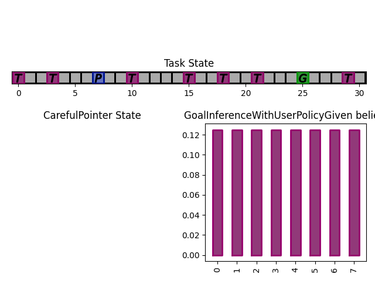
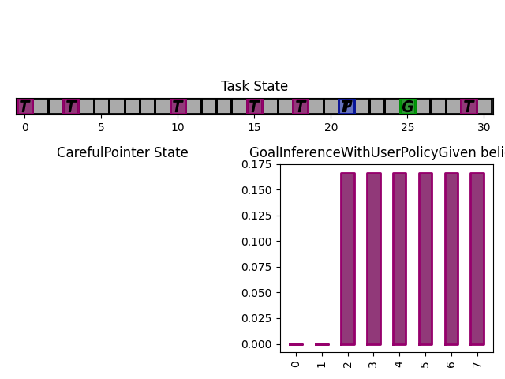
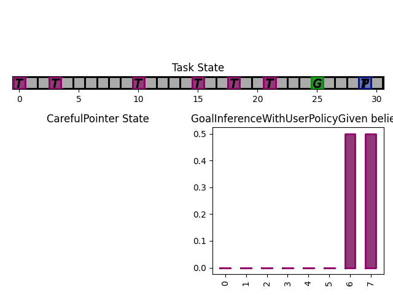

.. worked_out_example:

More Complex Example
-----------------------

In this example, we are going to build our first representation of an interactive system: we use a target-selection task, where the user's objective is to select a particular target known as the 'goal', by positioning a cursor on top of the goal. The assistant can help the user, positioning the cursor anywhere inside a grid.

Task
^^^^^^
We first build a simple 1D gridworld (below is what it should look like)

.. image:: images/simplepointingtask_render.png
    :align: center
    :width: 800

The user goal is the green 'G', the current cursor position is the blue 'P' and the other targets are the purple 'T's. The cursor can go anywhere within this space.

To define a new task, we subclass ``InteractionTask`` and override the needed methods.

.. literalinclude:: ../../coopihc/examples/simplepointing.envs.py
    :linenos:
    :lines: 17-109

Synthetic User Model
^^^^^^^^^^^^^^^^^^^^^^
We now define a user model, that we call ``CarefulPointer``. To do so, we describe the 4 components of the CoopIHC BaseAgent: state, observation and inference engines, and policy. 

.. literalinclude:: ../../coopihc/examples/simplepointing.users.py
    :linenos:
    :pyobject: CarefulPointer

Notice that the code re-uses two existing classes: ``ELLDiscretePolicy`` and ``RuleObservationEngine``. The hope is that in many cases, you can re-use existing *CoopIHC* objects rather than code everything from scratch.

Assistant
^^^^^^^^^^
We are going to couple this operator with an intelligent assistant which leverages Bayesian Information Gain (BIG) [Liu2017]_. This assistant follows two mechanisms:

    1. It holds a belief vector, that assigns each target with a probability (namely the probability that that particular target is the user goal). This belief is maintained by a particular inference engine called ``GoalInferenceWithUserPolicyGiven``, which as the name suggests, is capable of updating the beliefs associated with each target by leveraging a user model.
    2. It maintains a policy, that at each step, puts the cursor in a position that is going to be maximally informative for the assistant. This policy is implemented as a ``BIGDiscretePolicy``.

.. literalinclude:: ../../coopihc/examples/simplepointing.assistants.py
    :linenos:
    :pyobject: BIGGain

Bundle
^^^^^^^^^
Now that all components are ready, we can bundle them together to evaluate this combination of user model and assistant. 

.. literalinclude:: ../../coopihc/examples/simplepointing.scripts/basic_big.py
    :linenos:
    

This assistant has very good performance (it should, we have given it the true user model, which is also really simple)

The figures below show a run, which finished in 3 steps with the task state as well as the assistant beliefs rendered. 

.. image:: images/biggain_3.png
    :width: 49%

What next
^^^^^^^^^^
The example that we have just seen is what you would expect from an early prototype. Several extensions and enhancements could follow:

    1. You could use a more complex user model to pair with the assistant. For example, a visual search model could determine how the cursor is located after a 'jump', penalizing frequent and high amplitude jumps. A motor control model could determine how the cursor moves (e.g. fast initially, and much slower towards the end. To see such examples, head over to :doc:`modularity`.
    2. Alternatively, you could learn the user behavior for a given assistant policy, e.g. via Deep Reinforcement Learning. See :doc:`learning` for an example.
    3. You could tune the BIGGain assistant to account for the extra cost associated with jumps in the cursor.
    4. You could look at the effect of model mismatch between the model handled by the BIGGain assistant and the synthetic user model
    5. You could pair your assistant with a real user to evaluate its short term performance. See :doc:`realuser` for an example.
    6. You could jointly train the user model and the assistant to simulate co-adaptation between a user and a tool.

.. [Liu2017] Liu, Wanyu, et al. "Bignav: Bayesian information gain for guiding multiscale navigation." Proceedings of the 2017 CHI Conference on Human Factors in Computing Systems. 2017.