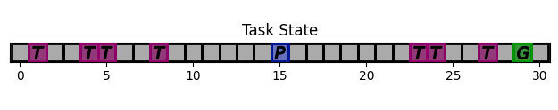

.. quickstart:

Quick Start
===============

Installation
---------------

Copy the files somewhere and run (-e for editable, optional)

.. code-block:: python

    pip install -e .

Imports
------------
The examples below assume the following imports. Adapt to your needs

.. code-block:: python

    from core.bundle import PlayNone, PlayOperator, PlayAssistant, PlayBoth, Train, SinglePlayOperator, SinglePlayOperatorAuto
    from pointing.envs import SimplePointingTask
    from pointing.operators import CarefulPointer
    from pointing.assistants import ConstantCDGain, BIGGain
    from eye.envs import ChenEyePointingTask
    from eye.operators import ChenEye

Basic Example
-----------------
We start with a 1D pointing task, in the shape of a gridworld, called ``SimplePointingTask``. There is a target goal (green), a cursor (blue) which should be positioned on the goal for the task to end, and some surrounding targets (violet). We consider a task with 31 possible positions for the cursor and 10 targets in total.

.. code-block:: python

    task = SimplePointingTask(gridsize = 31, number_of_targets = 10)

This is what the task looks like once rendered.

Consider a user which only indicates the direction of the target, with the left or right arrow keys (or in other words, its actions are either -1 or +1). There is an operator predefined for this, called the ``CarefulPointer``.

.. code-block:: python

    operator = CarefulPointer()

Couple this operator with an assistant which multiplies the operator action by 1 (this is called a constant unit CD gain in the pointing context). There is also an assistant predefined for this, called the ConstantCDGain.

.. code-block:: python

    assistant = ConstantCDGain(1)

Now, bundle the task, operator and assistant together using a bundle. Here, we bundle using PlayNone, which means that the actions of the operators and assistants will be sampled directly from the agent's policies.

.. code-block:: python

    bundle = PlayNone(task, operator, assistant)
    game_state = bundle.reset()
    bundle.render('plotext')
    while True:
        sum_rewards, is_done, rewards = bundle.step()
        bundle.render('plotext')
        if is_done:
            bundle.close()
            break

We can use a different bundle if we want to 'play' the assistant, i.e. choose the assistant's actions. For example, we can select the action '1' for the assistant at each time step, which replicates the unit CD Gain just previously seen:

.. code-block:: python

    task = SimplePointingTask(gridsize = 31, number_of_targets = 10)
    operator = CarefulPointer()
    # Any compatible assistant could have been used here
    assistant = ConstantCDGain(1)

    bundle = PlayAssistant(task, operator, assistant)
    game_state = bundle.reset()
    bundle.render('plotext')

    while True:
        # Select action '1' for the assistant
        observation, sum_rewards, is_done, rewards = bundle.step([1])
        bundle.render('plotext')
        if is_done:
            bundle.close()
            break

The performance of this assistant, measured in number of turns required to terminate the bundle, is equal to the initial distance between goal and cursor.
We can come up with a more effective form of assistance.
For example, let's try out a simple heuristic rule with adaptive gain.

.. code-block:: python

    task = SimplePointingTask(gridsize = 31, number_of_targets = 10)
    operator = CarefulPointer()
    assistant = ConstantCDGain(1)

    bundle = PlayAssistant(task, operator, assistant)
    game_state = bundle.reset()
    bundle.render('plotext')

    # The heuristic is as follows: Start with a high gain. The operator should always give the same action. If at some point it changes, it means the operator went past the target and that the cursor is very close to the target. If that is the case, divide the gain by 2, but never less than 1.

    # Start off with a high gain
    gain = 4
    # init for the adaptive algorithm
    sign_flag = game_state["assistant_state"]['OperatorAction'][0]
    observation = game_state

    while True:
        # Check whether the operator action changed:
        sign_flag = sign_flag * observation["assistant_state"]['OperatorAction'][0]
        # If so, divide gain by 2
        if sign_flag == -1:
            gain = max(1,gain/2)
        # Apply assistant action
        observation, sum_rewards, is_done, rewards = bundle.step([gain])
        bundle.render('plotext')

        if is_done:
            bundle.close()
            break

We can encode this behavior into an assistant policy, and define a new assistant. We will so this later. Several assistants already exist in *interaction-agents*.
For example, below, we use a Bayesian Information Gain (BIG) assistant.

.. code-block:: python

    task = SimplePointingTask(gridsize = 31, number_of_targets = 10)
    operator = CarefulPointer()
    assistant = BIGGain(operator.operator_model)

    bundle = PlayNone(task, operator, assistant)
    game_state = bundle.reset()
    bundle.render('plotext')
    while True:
        sum_rewards, is_done, rewards = bundle.step()
        bundle.render('plotext')
        if is_done:
            bundle.render('plotext')
            break

This assistant has very good performance, and reaches the goal usually in less than 3 steps. The figures below show a run, which finished in 3 steps. The task state as well as the internal state of the assistant and operator are shown. The operator's state is simply the goal. The assistant's internal state is more interesting and shows the belief that the assistant maintains regarding the probability that each target is the operator goal.

.. image:: images/biggain_1.png
    :width: 49%

.. image:: images/biggain_2.png
    :width: 49%

.. image:: images/biggain_3.png
    :width: 49%

.. image:: images/biggain_4.png
    :width: 49%

The BIGGain assistant, while giving good performance, does not minimize the number of steps needed to achieve the goal. We can try to get a better performing oeprator/assistant couple using Reinforcement Learning. To do this, simply wrap up the bundle ``Train`` and use an off-the-shelf RL algorithm:

.. code-block:: python

    task = SimplePointingTask(gridsize = 31, number_of_targets = 10)
    operator = CarefulPointer()
    assistant = ConstantCDGain(1)

    bundle = PlayAssistant(task, operator, assistant)
    env = Train(bundle)
    check_env(env)

The ``check_env`` method makes sure the environment is compatible with open AI's gym API.

An overview of *interaction-agents*
-----------------------------------------------------

1. *interaction-agents* comes equipped with presently two tasks (pointing with a cursor, and a human eye-gaze selection task). Look at the list of modules [link].
2. Several operators and assistants are provided, some generic and described in the agent sections [link], others adapted to one of the tasks, described in the modules [link]
3. Several bundles are provided, that cover many use cases. These are described in the bundles section [link]
4. One can define new agents by minimally writing new code, by taking advantage of the modular approach of *interaction-agents*. In particular, inference engines [link], observation engines [link], and operator models [link] can be re-used and sub-classed.  

What's next?
------------------------
Not only does coming up with realistic tasks and operators, and high performance assistants, take a lot of time, it also requires a different skill set. Realistic tasks require a good grasp of interface design, while operator modeling is based on the understanding of a human's various cognitive, motor capabilities. Good assistants on the other hand require advances planning strategies.

One of the ideas of *interaction-agents* is to separate each of these 'burdens'. One can for example implement a realistic HCI task, while another can work on an efficient planning strategy. The standard API makes sure that the two components will be inter-operable.

Another thing to look for is whether or not the interaction model is sufficient for most HCI scenarios. If not, the model should be updated to encompass more cases.
