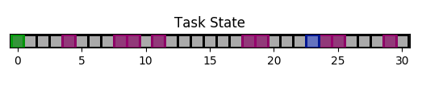

.. tasks:

Tasks
==================
Tasks are similar to gym environments. The main differences are:

1. No action spaces and observations spaces need to be defined. These are all gathered automatically by the bundle from the operators and assistants.
2. The usual step() method is decomposed into two steps:

    * An operator step which describes how the task changes state after the operator's turn
    * An assistant step which describes how the task changes state after the assistant's turn

.. note::

    It is recommended that new tasks be defined by subclassing the ``InteractionTask`` class [link].

Below we cover the example of the ``SimplePointingTask`` of the pointing module [link], obtained by subclassing ``InteractionTask``.

The ``SimplePointingTask`` Example
-----------------------------------

The context of the task is as follows: Inside a 1D grid of size 'Gridsize', there is a cursor at a certain 'Position' and there are several potential 'Targets'. The operator picks a goal at the start of each run and will perform actions to move the cursor around. The assistant helps the operator by modulating the operator actions.

The ``__init__()`` method
""""""""""""""""""""""""""""""
It is recommended to call the ``super().__init__()`` method before anything else.
The state of the game has to be an ``OrderedDict``.

.. code-block:: python

    def __init__(self, gridsize = 31, number_of_targets = 10):
        super().__init__()
        self.state = OrderedDict({'Gridsize': [gridsize], 'Position': [2], 'Targets': [3,4]})
        self.number_of_targets = 10

.. note::

    Whether an invariant quantity should be stored in the task state or as a task attribute is up to the modeler. Usually, it makes sense to include it if that quantity is useful for training. Whatever is in the state will be observable by agents, but attributes are also accessible via each agent's bundle attribute. States can also be 'squeezed' to remove substates not needed for training.

The ``reset()`` method
""""""""""""""""""""""""""
In the reset method here, we simply draw new targets and initial cursor positions to get a new value for the task state. Here, the 'grid' used for rendering is also reset.

.. code-block:: python

    def reset(self, *args):

        if args:
            raise NotImplementedError
        else:
            self.grid = [' ' for i in range(self.state['Gridsize'][0])]
            targets = sorted(numpy.random.choice(list(range(self.state['Gridsize'][0])), size = self.number_of_targets, replace = False))
            for i in targets:
                self.grid[i] = 'T'
            # Define starting position
            copy = list(range(len(self.grid)))
            for i in targets:
                copy.remove(i)
            position = int(numpy.random.choice(copy))
            self.state['Position'] = [position]
            self.state['Targets'] = targets

The ``operator_step()`` method
"""""""""""""""""""""""""""""""""
Since the assistant modulates the operator action, the task state will only evolve when the assistant issues an action. Thus, during the operator_step, nothing happens. It is recommended to call the super().operator_step method to increment the turns.

.. code-block:: python

    def operator_step(self, operator_action):

        return super().operator_step(operator_action)

The ``assistant_step()`` method
"""""""""""""""""""""""""""""""""

Here the operator action is multiplied by the assistant action, and clipped to fit in the grid. The task state is then updated. If the cursor is on the correct target, then the task is finished.

.. code-block:: python

    def assistant_step(self, assistant_action):

        super().assistant_step(assistant_action)
        is_done = False
        operator_action = self.bundle.assistant.state['OperatorAction'][0]
        assistant_action = assistant_action[0]
        self.state['Position'] = [int(numpy.clip(numpy.round(self.state['Position'][0] + operator_action*assistant_action, decimals = 0), 0, self.state['Gridsize'][0]-1))]
        if self.state['Position'][0] == self.bundle.operator.state['Goal'][0]:
            is_done = True
        return self.state, -1/2, is_done, {}

The ``render()`` method
""""""""""""""""""""""""""""
The render method signature is ``def render(self, ax, *args, mode="text")``. The variable 'mode' is expected to be either 'text' or 'plot'. In text mode, a gridworld is printed out to the terminal. In plot mode, the gridworld is drawn to a matplotlib figure. The full code can be found [link].

.. code-block:: python

    def render(self, ax, *args, mode="text"):

        goal = self.bundle.operator.state['Goal'][0]
        self.grid[goal] = 'G'
        if 'text' in mode:
            tmp = self.grid.copy()
            tmp[int(self.state['Position'][0])] = 'P'
            _str = "|"
            for t in tmp:
                _str += t + "|"

            print('\n')
            print("Turn number {:f}".format(self.turn))
            print(_str)

            targets = sorted(self.state['Targets'])
            print('Targets:')
            print(targets)
            print("\n")
        if 'plot' in mode:
            if self.ax is not None:
                self.update_position()
            else:
                self.ax = ax
                self.init_grid()
                self.ax.set_aspect('equal')
        if not ('plot' in mode or 'text' in mode):
            raise NotImplementedError

Examples of the render:

Text mode

.. code-block::

    Turn number 0.000000
    |G| | | |T| | | |T|T| |T| | | | | | |T|T| | | |P|T|T| | | |T| |
    Targets:
    [0, 4, 8, 9, 11, 18, 19, 24, 25, 29]

Plot mode:

Tasks Zoo
----------------

Core Module:

* InteractionTask [link]: to be subclassed

Pointing Module:

* SimplePointingTask [link]: A 1D grid of size 'Gridsize'. The cursor is at a certain 'Position' and there are several potential 'Targets' on the grid. The operator action is modulated by the assistant.

Eye Module:

* ChenEyePointingTask [link]: A pointing task performed by the Eye, according to Chen, Xiuli, et al. "An Adaptive Model of Gaze-based Selection" Proceedings of the 2021 CHI Conference on Human Factors in Computing Systems. 2021. This tasks only requires an operator (human perception task).
