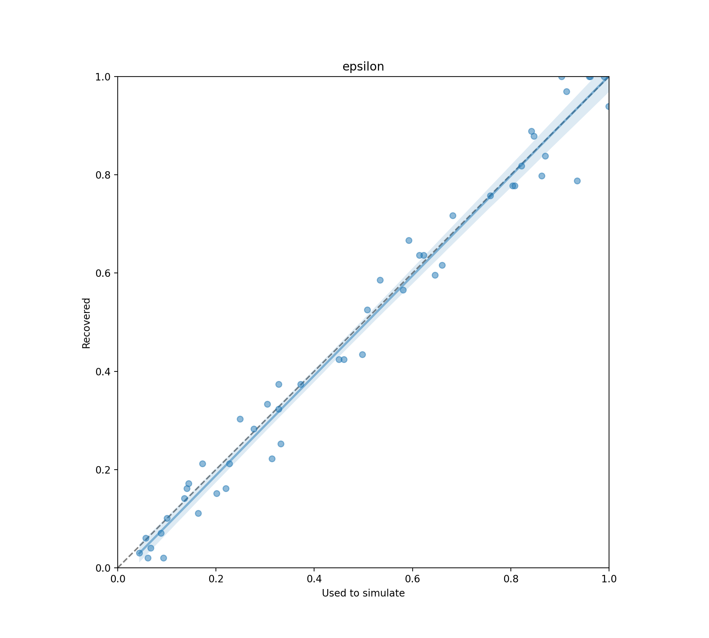
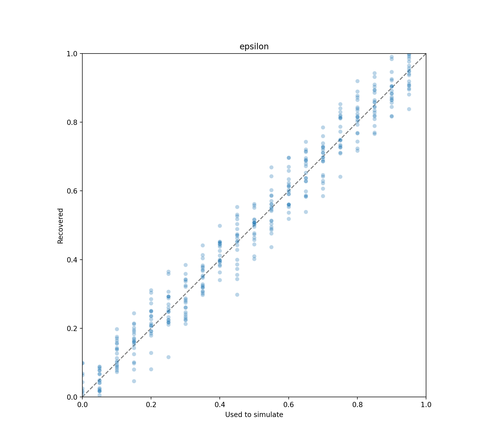
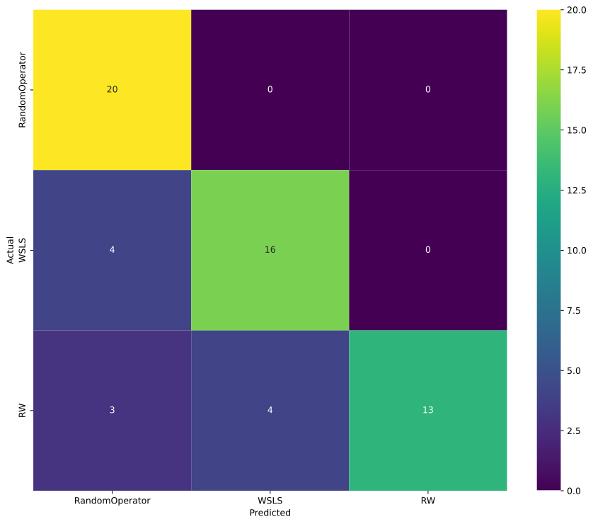
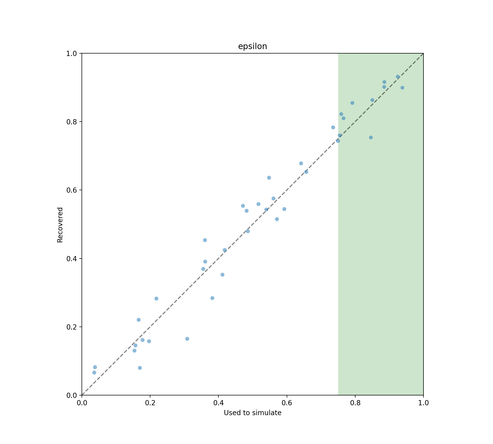

.. user_modeling:

User Modeling Facilitation
=============================

Facilitating user modeling with bundles. allow evaluation, training, parameter recovery etc.

To see how user modeling can be facilitated, we first build on a model presented `by Chen et al. <https://dl.acm.org/doi/fullHtml/10.1145/3411764.3445177>`. This will form the basis to which we will apply [things mentioned above].

Eye Fixation Model
--------------------
The model assumes the following:

* There is a screen with some target, that the eye should point towards. This constitutes the task
* The user controls the eye; it does so by
    * Receiving noisy information about the target location
    * Handling beliefs about where the target might be, based on received information
    * Issuing the next position of the eye by selecting the most probable location based on handled beliefs
    * That action is corrupted by noise.

In all cases, the noise intensity is dependent on the distance between the target and the position.
* The task is done once the current eye position is close enough to the target, as determined by a threshold.

The code snippet below creates the needed bundle. First, we initialize a 1D pointing task, where the size and distance of the target are given by W and D.
We associate a ChenEye user to the task, also in 1D. It gets as input the scaling linear coefficient for signal dependent noise (noise = coef * N(0,1)), for observation (perceptualnoise) as well as for moving the eye (oculomotornoise). These are bundled into a SinglePlayUser bundle, which allows one to play as user to experiment with policies. One could have also used a SinglePlayUserAuto bundle to directly evaluate the policy explained above, based on beliefs.

.. code-block:: python

    fitts_W = 4e-2
    fitts_D = 0.8
    perceptualnoise = 0.2
    oculomotornoise = 0.2
    task = ChenEyePointingTask(fitts_W, fitts_D, dimension = 1)
    user = ChenEye(perceptualnoise, oculomotornoise, dimension = 1)
    bundle = SinglePlayUser(task, user)

    
Parameter Recovery
---------------------------------

In parameter recovery, a user model is tested on its ability to infer known parameters from an artificial experiment dataset.
If a model fails to do so, it is unlikely to be useful for inferring parameters from a dataset created with human users.

.. note::

    Parameter recovery has only been implemented for agents with an ``ELLDiscretePolicy`` (explicit discrete likelihood).
    While a likelihood-free approach is possible, it is not a part of this package so far.

In the code below, we define a new kind of interaction task--in this case a risky choice task called ``MultiBanditTask``--and test an user class, namely Win-Stay-Lose-Switch (``WSLS``) for its ability to recover the single parameter ``epsilon``.

.. code-block:: python

    # Imports
    from envs import MultiBanditTask
    from agents import WSLS

    from core.bundle import ModelChecks

    # Task parameters definition
    N = 2
    P = [0.5, 0.75]
    T = 100

    # Task definition
    multi_bandit_task = MultiBanditTask(N=N, P=P, T=T)

    # User definition
    wsls = WSLS(epsilon=0.1)

In order to test the model for parameter recovery, we need to use the ``ModelChecks`` bundle and pass it both the user as well as the task.
In turn, it gives us access to two methods called ``test_parameter_recovery`` for a Frequentist and ``test_bayesian_parameter_recovery`` for a Bayesian workflow that can be used to evaluate parameter recovery for the given user class and task.

Depending on the modeling workflow, Frequentist or Bayesian, the ``ModelChecks`` bundle provides two different methods to perform parameter recovery, either based on maximum likelihood (Frequentist) or a prior distribution for each parameter (Bayesian).

Frequentist Parameter Recovery
~~~~~~~~~~~~~~~~~~~~~~~~~~~~~~~~~

The ``test_parameter_recovery`` expects an argument called ``parameter_fit_bounds`` which is a ``dict`` containing the parameter name and its minimum and maximum value (i.e. its fit bounds).
These fit bounds will be used to create ``n_simulations`` artificial agents with random parameters within them.
Each of the artificial agents will execute the task to create simulated data which in turn can be used to infer the best-fit parameter values using an evaluation method, in this case maximum log-likelihood.

The result of calling ``test_parameter_recovery`` is an object giving access to, among other details, a boolean whether all parameter correlations (i.e. Pearson's r for the correlation between the used and recovered parameter values) meet the specified ``correlation_threshold`` at the specified ``significance_level``.

.. code-block:: python

    # Parameter fit bounds for user
    wsls_parameter_fit_bounds = {"epsilon": (0., 1.)}

    # Population size
    N_SIMULATIONS = 20

    # Bundle defintion
    wsls_bundle = ModelChecks(task=multi_bandit_task, user=wsls)

    # Parameter recovery check
    parameter_recovery_test_result = wsls_bundle.test_parameter_recovery(
        parameter_fit_bounds=wsls_parameter_fit_bounds,
        correlation_threshold=0.6,
        significance_level=0.1,
        n_simulations=N_SIMULATIONS
    )

    # Display scatter plot
    parameter_recovery_test_result.plot()

    # Print result
    successful = 'successful' if parameter_recovery_test_result.success else 'unsuccessful'
    print(f"WSLS: Parameter recovery was {successful}.")

To give an intuition of the kind of plot that can be expected as a result of the Frequentist parameter recovery test, see the scatter plot below:

.. _parameter_recovery_fig_label:

    The resulting parameter recovery plot for one example parameter recovered via a maximum likelihood (Frequentist) workflow. The dashed identity line represents perfect recovery.

Bayesian Parameter Recovery
~~~~~~~~~~~~~~~~~~~~~~~~~~~~

The ``test_bayesian_parameter_recovery`` expects an argument called ``parameter_priors`` which is a ``dict`` containing the parameter name and prior distribution as a ``pyro.distributions.Distribution``.
These priors will be used to create ``n_simulations`` artificial agents with random parameters sampled from the priors within them.
Each of the artificial agents will execute the task to create simulated data which in turn can be used to infer a posterior distribution of the best-fit parameter values using an evaluation method, in this case Markov Chain Monte Carlo (MCMC) with a No-U-Turn Sampler (NUTS).

The result of calling ``test_bayesian_parameter_recovery`` is an object giving access to, among other details, a plot method to inspect the posterior distributions for the parameters.

.. code-block:: python

    # Imports
    import pyro

    # Parameter priors for user definition
    wsls_parameter_priors = {"epsilon": pyro.distributions.Uniform(0.0, 1.0)}

    # Parameter fit bounds for plot
    wsls_parameter_fit_bounds = {"epsilon": (0., 1.)}

    # Population size
    N_SIMULATIONS = 20

    # Bundle definition
    wsls_bundle = ModelChecks(task=multi_bandit_task, user=wsls)

    # Parameter recovery check
    bayesian_parameter_recovery_test_result = wsls_bundle.test_bayesian_parameter_recovery(
        parameter_priors=wsls_parameter_priors,
        num_mcmc_samples=100,
        n_simulations=N_SIMULATIONS,
    )

    # Display scatter plot for posteriors
    bayesian_parameter_recovery_test_result.plot(parameter_fit_bounds=wsls_parameter_fit_bounds)

To give an intuition of the kind of plot that can be expected as a result of the Bayesian parameter recovery test, see the scatter plot below:

.. _bayesian_parameter_recovery_fig_label:

    The resulting parameter recovery plot for one example parameter recovered via a maximum likelihood (Frequentist) workflow. The dashed identity line represents perfect recovery.

Model Recovery
-------------------

In model recovery, a user model is tested on its ability to be inferred from an artificial experiment dataset in competition to alternative user models.
If a model fails to do so, it is unlikely to be successfully recovered from a dataset created with human users.

.. note::

    Model recovery has only been implemented for agents with an ``ELLDiscretePolicy`` (explicit discrete likelihood).
    While a likelihood-free approach is possible, it is not a part of this package so far.

In the code below, we use the same interaction task as above--again a risky choice task called ``MultiBanditTask``--and test the user class used above, namely Win-Stay-Lose-Switch (``WSLS``), against two new user classes, a random user (``RandomPlayer``) and Rescorla-Wagner (``RW``), for its ability to be recovered from an artificial dataset.

.. code-block:: python

    # Imports
    from envs import MultiBanditTask
    from users import WSLS, RW, RandomPlayer

    from core.bundle import ModelChecks

    # Task parameters definition
    N = 2
    P = [0.5, 0.75]
    T = 100

    # Task definition
    multi_bandit_task = MultiBanditTask(N=N, P=P, T=T)

    # User definition
    wsls = WSLS(epsilon=0.1)
    rw = RW(q_alpha=0.1, q_beta=1.)

In order to test the model for model recovery, we need to, again, use the ``ModelChecks`` bundle and pass it both the user as well as the task.
In turn, it gives us access to a method called ``test_model_recovery`` that can be used to evaluate model recovery for the given user classes and task.

The ``test_model_recovery`` expects an argument called ``other_competing_models`` which is a list of dictionaries specifying the competing models and their parameter fit bounds (e.g. ``[{"model": UserClass, "parameter_fit_bounds": {"alpha": (0., 1.), ...}}, ...]``) as well as ``this_parameter_fit_bounds`` which is a ``dict`` containing the parameter name and its minimum and maximum value (i.e. its fit bounds) for the user class to test.
These fit bounds will be used to create ``n_simulations`` artificial agents for all specified models with random parameters within them.
Each of the artificial agents will execute the task to create simulated data which in turn can be used to infer the best-fit model using an evaluation method, in this case BIC-score.

The result of calling ``test_model_recovery`` is an object giving access to, among other details, a boolean whether all robustness statistics (i.e. F1-score for the precision and recall between the used and recovered models) meet the specified ``f1_threshold``.

.. code-block:: python

    # Parameter fit bounds for users
    wsls_parameter_fit_bounds = {"epsilon": (0., 1.)}
    rw_parameter_fit_bounds = {"q_alpha": (0., 1.), "q_beta": (0., 20.)}

    # Population size
    N_SIMULATIONS = 20

    # Bundle defintion
    wsls_bundle = ModelChecks(task=multi_bandit_task, user=wsls)

    # Competing models definitions
    other_competing_models = [
        {"model": RandomPlayer, "parameter_fit_bounds": {}},
        {"model": RW, "parameter_fit_bounds": rw_parameter_fit_bounds},
    ]

    # Model recovery check
    model_recovery_test_result = wsls_bundle.test_model_recovery(
        other_competing_models=other_competing_models,
        this_parameter_fit_bounds=wsls_parameter_fit_bounds, 
        f1_threshold=0.8,
        n_simulations=N_SIMULATIONS
    )

    # Display confusion matrix
    model_recovery_test_result.plot()

    # Print result
    successful = 'successful' if model_recovery_test_result.success else 'unsuccessful'
    print(f"WSLS: Model recovery was {successful}.")

To give an intuition of the kind of plot that can be expected as a result of the model recovery test, see the confusion matrix below:

.. _model_recovery_fig_label:

    The resulting model recovery plot for three example user models recovered via the Bayesian Information Criterion (BIC). In perfect recovery, all artificial agents would be correctly recovered (diagonal of the heatmap).

Recoverable Parameter Ranges
----------------------------

Testing parameter recovery for a parameter's entire theoretical or practical range, while generally useful and important, might mask some of the details that could become important when dealing with real user data.
Parameters could, for example, be generally recoverable for the entire parameter value range, but might not be recoverable for the specific parameter range that the real user data demands.
Or, in the opposite case, while the model's parameters might not be recoverable for the entire parameter range, they could be recoverable for the specific user data in question.
To give just two reasons as to why this might be the case, the parameters might not be independent and therefore introduce unwanted interaction effects when testing the entire parameter range or one of the parameters might enact such a strong influence on the resulting behavior exhibited by a user given certain values that recovery for the other parameter values becomes nearly impossible (e.g. in the case of large inverse temperature parameter values).
For this reason, testing recovery for different sub-ranges of the parameters' spectrum can give important insights towards the usefulness and limitations of a given user model or user class.

.. note::

    Parameter recovery has only been implemented for agents with an ``ELLDiscretePolicy`` (explicit discrete likelihood).
    While a likelihood-free approach is possible, it is not a part of this package so far.

The code below gives an example on how the ``ModelChecks`` bundle provides support in identifying those parameter ranges that can be recovered.
For this, we will again use the interaction task ``MultiBanditTask`` and the user class Win-Stay-Lose-Switch (``WSLS``) with its parameter ``epsilon``.
This parameter has a theoretical range from ``0.0`` to ``1.0``. We will try to identify the recoverable sub-ranges within those theoretical bounds using the ``test_recoverable_parameter_ranges`` helper method.

.. code-block:: python

    # Imports
    from envs import MultiBanditTask
    from users import WSLS, RW, RandomPlayer

    from core.bundle import ModelChecks

    # Task parameters definition
    N = 2
    P = [0.5, 0.75]
    T = 100

    # Task definition
    multi_bandit_task = MultiBanditTask(N=N, P=P, T=T)

    # User definition
    wsls = WSLS(epsilon=0.1)

First, we specify those parameter ranges that we want to test using the ``numpy.linspace`` function.
This function returns an ``ndarray`` with ``num`` (in this case 6) entries linearly spaced out over the specified range.
In effect, this will split the theoretical range for the ``epsilon`` parameter into sub-ranges of width 0.2.

This range is then passed, together with some additional arguments like the thresholds for the Pearson's r correlation coefficient and the significance level or the number of simulated agents per sub-range, to the ``test_recoverable_parameter_ranges`` method.
It returns an object that--among other useful information--gives access to a plot (in this case a scatter plot displaying the 'known' and recovered parameter values and highlighting the recoverable sub-ranges with a green area) and a dictionary containing the ranges for each parameter where the recovery was successful.

.. code-block:: python

    # Define bundle for recoverable parameter ranges test
    wsls_bundle = ModelChecks(task=multi_bandit_task, user=wsls)

    # Define parameter ranges
    wsls_parameter_ranges = {
        "epsilon": numpy.linspace(0.0, 1.0, num=6),
    }

    # Determine ranges within the parameter fit bounds where the parameters can be recovered
    recoverable_parameter_ranges_test_result = wsls_bundle.test_recoverable_parameter_ranges(
        parameter_ranges=wsls_parameter_ranges,
        correlation_threshold=0.7,
        significance_level=0.05,
        n_simulations_per_sub_range=N_SIMULATIONS,
        seed=RANDOM_SEED)

    # Display scatter plot
    recoverable_parameter_ranges_test_result.plot()

    # Print result
    recoverable_ranges = recoverable_parameter_ranges_test_result.recoverable_parameter_ranges
    print(f"RW: Parameter recovery possible within these ranges: {recoverable_ranges}")

To give an intuition of the kind of plot that can be expected as a result of the test for recoverable parameter ranges, see the scatter plot below:

.. _recoverable_parameter_ranges_fig_label:

    The resulting recoverable parameter ranges plot for one example user model recovered via a maximum likelihood (Frequentist) workflow. The dashed identity line represents perfect recovery. The green areas represent recoverable bounds for the parameter value where both the correlation and significance level meet the specified thresholds.